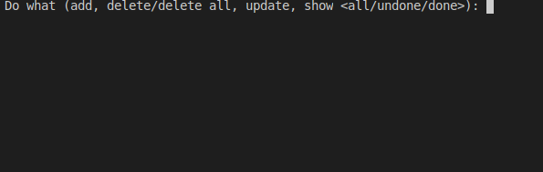
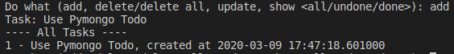
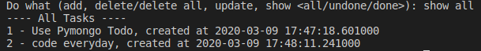
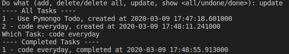
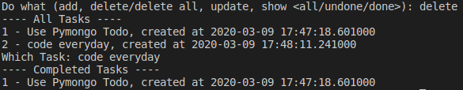

# :pen: PyMongo Todo
A simple command line todo app built in :snake: python with :heart: on MongoDB

### :paperclip: Usage
```python
$ python todo.py
```

### :package: Pre-requisites
- [MongoDB](https://docs.mongodb.com/manual/tutorial/install-mongodb-on-ubuntu/)
- Python Packages
    - pymongo
    - datetime 

> #### Note: 
    - Make sure your Mongo Daemon is running on  http://127.0.0.1:27017
    - It's up to you whether or not to create a **db** named _todo_ and **collection** named _todos_ in it.

### :camera: Samples


---

---

---

---

---

author: @manasakalaga

